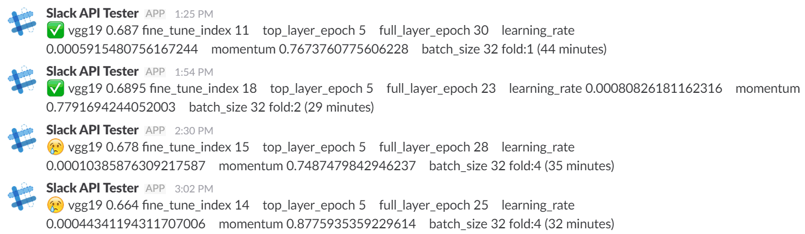
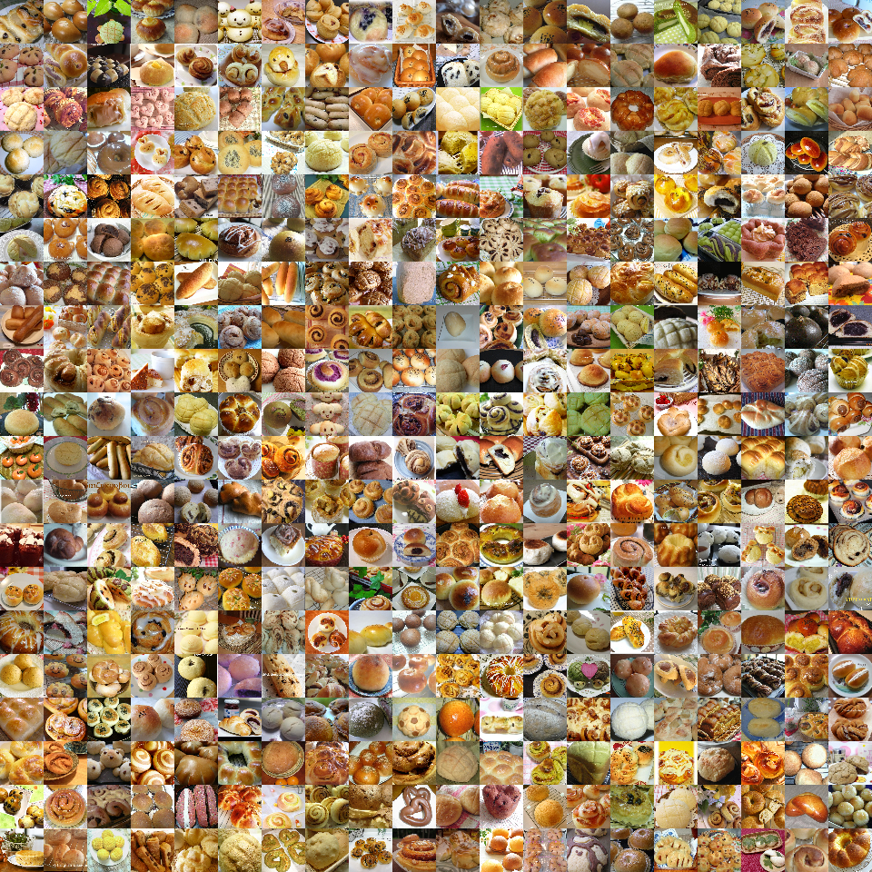

# 再現コードとモデリング詳細以外について

## 半教師あり学習

* 本コンテストでは、ラベルなし画像が50000枚提供されている。ラベルあり画像の5倍の量があり、うまく利用できれば精度を向上できる可能性がある。
現実問題としてもラベルの手付けはコストがかかるので、
少数のラベル付きデータと、多数のラベルなしデータから学習させたいシチュエーションは多く、半教師あり学習(Semi-supervised Learning)
という研究分野である。

* 以下の実験を行った
    * Kerasのresnetをラベル付き訓練データで学習する
    * 学習したモデルでラベルなし画像に対してpredictし、ラベルを付ける。これを擬似ラベルと呼ぶとする
    * ラベル付き画像10000枚、疑似ラベル付き画像5000枚でresnetを再度学習する (ラベル : 疑似ラベルの割合は2:1が良いと言われている)
    * これはPseudo Labelingと言われている
    * 結果、validation accuracyは上がったが、test accuracyは上がらなかった
        * 疑似ラベル付き画像を10000枚にしても同様
        * すでに予測できるものを学習画像として加えても精度が上がらないのは、それはそうだよねと思える
    * 実験結果から、本コンテストではラベルなし画像を使用しなかった
    
## Slack

* Deep Learningは学習に時間がかかるので、学習を開始したら放置することが多い。学習が終了したらSlackに通知するようにした
* 以下は、ハイパパラメータをランダムサーチしたときのSlackログ。外出先でも確認できた

## ハイパパラメータのランダムサーチ

* 以下のハイパパラメータの調整を試した
    * fine tune前に加えたtop layerのみの学習epoch
    * fine tune時のepoch
    * learning rate: 途中から0.1倍すると精度が上がった
    * momentum: デフォルト0.8だが0.75など小さいほうがよさそうだった
    * batch size: 大きい方がよさそうだったがGPUのメモリに制限される
    * freeze index: fine tune時にfreezeさせて重みを更新しない層数。全総数をNとすると、1/3層あたりがよさそうだった
* 上記のうちfreeze indexの影響が大きかったので、途中からはそれに絞って探索した
* 5 fold cross validationを行い、各5モデルのvalidation errorが低くなるようにしてから予測を統合したら精度が上がった
* 外出するときにくじ引き感覚で実行し、好きなときに止められるのが、ランダムサーチの良い点である

## Keras

* 最初はKerasで実験を行った。ドキュメントが丁寧なので、最初はKerasから始めるのがオススメ
* vgg16からresnet, xceptionなどのimagenet学習済みモデルが公開されている
* 仮説
    * ネットワーク構造の違うCNNを使うことで多様性ができ、それらをアンサンブルすることで精度が向上するのではないか
* 検証結果
    * vgg16, vgg19, inception-v3, inception-v4, resnet, xceptionを用い、各モデルの予測の重み付けは同一とした
    * 単体モデルよりもアンサンブルした方が精度が向上し、0.79まで出せた
* resnetが画像サイズが224x224で扱いやすく、訓練も速くて精度も高かったので、1モデル選ぶならresnetが良い
* 公式以外から、inception v4も取り込んだ https://github.com/kentsommer/keras-inceptionV4

## mxnet

* resnextの学習済みモデルために導入
* 学習後、Kerasの各モデルの予測と合成し、重み付け和も試したが、最終的にはresnextのみを用い、コンテスト中の精度は0.82, 
コンテスト後は最終スコア0.81639で2位だった

## 学習済みモデル

* imagenetで学習したモデルのfine tuningが、画像認識に有効な手法であり、公開されている重みを利用した
* imagenet-11kで学習したモデルを足したが、精度は向上しなかった。imagenetとは違うデータセットで学習することで多様性が出ると思ったがそうではなかった
* 海外の公開済みモデルにお世話になるばかりではなく、日本も学習済みモデルの公開をすべきと思った
* 大量の料理画像を学習した料理認識用のモデルや、ひらがなや漢字を分類するモデルの重みを公開してはどうか

## コンテストへの取り組み方

* Keras, mxnetの公式サイトを読む
* KaggleなどのImage classification系の工夫を読む
* Image classification系論文(VGG等)の画像前処理を読む
* 学習を回してSubmitを繰り返し、うまく行った手法を積み重ねる

## データの観察

* ラベルごとに画像をグリッド状に配置して1枚にし、データの傾向を観察した
    * 料理が画像の中央に写っていないものがある
    * 料理は自由であり、多様性が大きく、顔がついていたりもする
    * 画像加工で枠や文字が付いているものもある
    

## 器認識

* 料理は器の上に乗っていることが多く、器を認識することができればそこだけ切り取ってより精度の高い学習データ・テストデータとすることができると考えて実験した
* 器は円であると仮定し、画像のYスケールを変化させつつ、ハフ変換の円検出を行った
* 完全な円でないと検出しづらかった
* 10枚に1枚ほど、器検出できたので、器内部だけの画像も足して学習させたが、精度は向上しなかった。理由は2つ考えられる
    * 器検出の誤検出のため
    * Data Augmentationですでに満たされている
* 器検出器をCNNで実装できれば、円以外の器も検出できるだろう

### 再現コードとモデリング詳細について

* [README.jp.md](./README.jp.md)